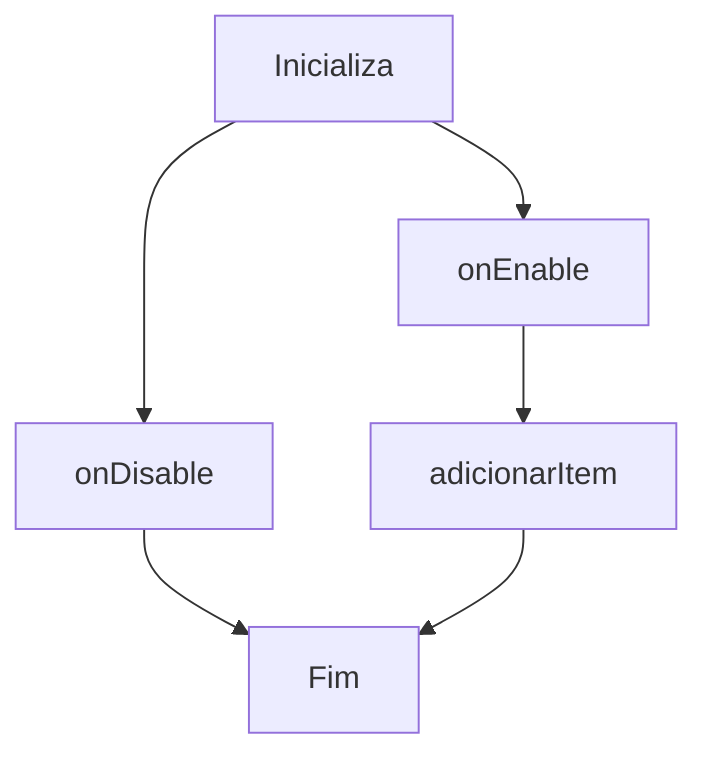

# BK Kit básico de alimentação no inicio do Minecraft

Explicações:

onEnable():

Inicializa o plugin, carrega configurações, registra eventos e comandos.

Verifica se o plugin está habilitado na configuração e, se não, o desativa.

onDisable():

Desabilita o plugin.

Adiciona itens ao inventário do jogador, limitando a 3 vezes.

Realiza verificações de permissão e argumentos.

Executa ações diferentes dependendo do comando.

Verifica se o jogador que executou o comando é um jogador ou o console.

Verifica as permissões do jogador.

Gerencia os kits dos vips.

Gerencia a adição e remoção de vips.

Gerencia o comando de /limpar o inventário.

Dependencia LuckPerms-Bukkit-5.4.156 https://luckperms.net/

         Command: /oi
                  /vip
                  /addvip <name>
                  /rmvip <name>
                  /lilith (kit Bruxa)
                  /emanuel (kit stive Apocaliptico)
                  /eva (kit rainha do mar)
                  /adan (kit escravo da terra)
                  /limpar (limpar o inventário.)

# Testamento de (Z) or (D) Z.eus aos 4

XAΓ O Chi Rho é formado pela combinação das duas primeiras letras da palavra grega Christos, 
que significa "Cristo".  estratégia de precificação, escala, série de ideias,  uma estrela, um macho dominante

ΘΕ Consciência emocional é pequena e leva a Morte (LILITH)

ΔΙ LAtino Pequeno (Homen Barro Adão)

ΣΚ Lesbica Feminista é uma criatura aquática, semelhante a uma tartaruga, que habita rios e lagos ( EVA e Seus pecados Do mundo)

