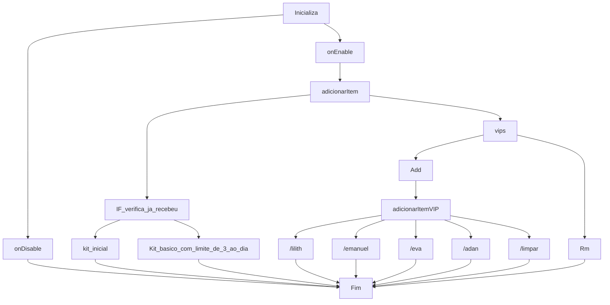

BK – Basic Food Kit Plugin for Minecraft
Enhance the early-game experience in Minecraft with BK Kit, a plugin designed to provide players with essential food resources upon starting their journey.
Language Support:
Supported languages: BR, EN, ES, FR, DE.
Functionality Overview:
onEnable():
- Initializes the plugin, loads configurations, registers events and commands.
- Checks if the plugin is enabled—if not, it automatically deactivates.
onDisable():
- Disables the plugin when necessary.
- Adds food items to the player's inventory (limited to 3 times).
- Performs permission and argument checks.
- Executes different actions based on the command entered.
- Identifies whether the command was executed by a player or the console.
- Manages player permissions and VIP kits.
- Handles VIP additions and removals.
- Allows players to use /limpar to clear their inventory.
Dependencies:
This plugin requires LuckPerms-Bukkit-5.4.156 for proper permission handling.

Dependencia LuckPerms-Bukkit-5.4.156 https://luckperms.net/

         Command: /oi
                  /vip
                  /addvip <name>
                  /rmvip <name>
                  /lilith (kit Bruxa)
                  /emanuel (kit stive Apocaliptico)
                  /eva (kit rainha do mar)
                  /adan (kit escravo da terra)
                  /limpar (limpar o inventário.)

# Testamento de (Z) or (D) Z.eus aos 4

XAΓ O Chi Rho é formado pela combinação das duas primeiras letras da palavra grega Christos, 
que significa "Cristo".  estratégia de precificação, escala, série de ideias,  uma estrela, um macho dominante

ΘΕ Consciência emocional é pequena e leva a Morte (LILITH)

ΔΙ LAtino Pequeno (Homen Barro Adão)

ΣΚ Lesbica Feminista é uma criatura aquática, semelhante a uma tartaruga, que habita rios e lagos ( EVA e Seus pecados Do mundo)

# Fluxo Grama 

           a ideia e ser 4 presentes para um vip ou um moderador poder dar a alguem se quise...

